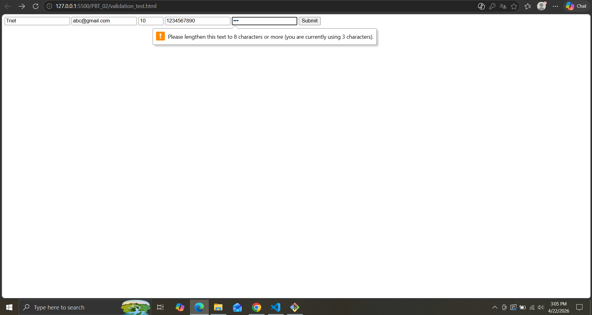

CÂU A1: Input Types
1. type="text" -> Ô nhập text, không có validation tự động -> dùng cho form nhập thông tin
2. type="email" -> Ô nhập text, có tự kiểm tra @ -> dùng cho form đăng nhập, đăng ký
3. type="password" -> Ô nhập text có ẩn ký tự, không có validation tự động -> dùng cho form đăng nhập, đăng ký
4. type="number" -> Ô nhập số có nút tăng giảm, có các validation: min,max,step -> dùng khi chọn số lượng sản phẩm
5. type="tel" -> Ô nhập số có bàn phím số trên điện thoại, có validation: pattern -> dùng cho form nhập thông tin liên hệ
6. type="date" -> Bộ chọn ngày tháng năm, có kiểm tra định dạng ngày,tháng,năm và min, max -> dùng cho form nhập thông tin cá nhân 
7. type="color" -> Bộ chọn màu sắc, không có validation tự động -> dùng khi chọn màu sản phẩm
8. type="range" -> Thanh kéo, kiểm tra min, max, step -> dùng chọn khoảng giá sản phẩm
9. type="file" -> Tải file lên, có giới hạn loại file (accept), chọn nhiều file (multiple) -> dùng khi tải ảnh sản phẩm lên phần đánh giá
10. type="search" -> Ô nhập tìm kiếm, không có validation tự động -> dùng khi tìm kiếm sản phẩm

CÂU A2: 
DỰ ĐOÁN:
    - Trường hợp 1: submit thất bại vì trong thẻ <input> dùng type="text" có require bắt buộc phải có giá trị nhưng giá trị lại để trống khi bấm submit sẽ hiện thông báo lỗi.
    
    - Trường hợp 2: submit thất bại vì type="email" nên sẽ có kiểm tra xem giá trị có "@" hay không nhưng giá trị trong thẻ lại là "abc" không có dấu @ nên khi bấm submit sẽ hiện thông báo lỗi.
    
    -Trường hợp 3: submit thất bại vì trong thẻ <input> dùng type="number" và 2 thuộc tính min="1" và max="10" nhưng giá trị lại là 15 vượt quá giới hạn nên khi submit sẽ hiện thông báo lỗi.
    
    -Trường hợp 4: submit thất bại vì trong thẻ <input> dùng type="text" và có pattern="[0,9]{10}" yêu cầu nhập 10 số với giá trị từ 0 đến 9 nhưng giá trị đầu vào lại có "abc" nên khi bấm submit sẽ hiện thông báo lỗi.
    
    -Trường hợp 5: submit thất bại vì trong thẻ <input> dùng type="password" và yêu cầu tối thiểu độ dài là từ 8 (minlength="8") nhưng giá trị độ dài chỉ có 3 nên khi submit sẽ hiện thông báo lỗi 
    

CÂU A3: 
    1. Screen reader là công cụ giúp người khiếm thị nghe được nội dung trang web.Khi người đọc lướt đến khu vực có thẻ <input> mà không có thẻ <label> chứa id định dạng của input thì screen reader sẽ không biết thẻ <input> dùng để nhập cái gì.Khi có thuộc tính id trong <input> và for trong <input> thì khi lướt đến công cụ screen reader sẽ đọc khi khu vực này nhập gì.
    2. Trong 1 form có nhiều thẻ <input> và nếu muốn tổ chức form rõ ràng cho người dùng.
    VD:
        <form>
            <fieldset>
                <legend>Thông tin cá nhân</legend>
                
                <label>Họ tên:</label>
                <input type="text">  
                
                <label>Email:</label>
                <input type="email">
            </fieldset>

            <fieldset>
                <legend>Sở thích</legend>
                
                <input type="checkbox"> Đọc sách 
                <input type="checkbox"> Chơi game 
                <input type="checkbox"> Code
            </fieldset>
        </form> 
    Ta thấy như ví dụ trên nếu sử dụng <field set> + <legend> ta sẽ dễ dàng nhân biết được các khung input khác nhau và mỗi khung có 1 tiêu đề rõ ràng.
    3. aria-label có thể được dùng nếu như ta không sử dụng thẻ <label> cho <input>.Nếu như ta đã có thẻ <label> mà dùng tiếp aria-label thì sẽ bị thừa.

CÂU A4:
    1. Thuộc tính loading="lazy" trong thẻ  giúp cho ảnh chỉ hiển thị khi lướt đến.Nó giúp cải thiện tốc độ load trang, nếu người dùng không lướt đến khu vực đấy thì trang sẽ không hiện ảnh giúp tiết kiệm data.
        - Khi nào không nên dùng:
            + Nếu người dùng muốn thấy ảnh ngay không phải lướt đến mới thấy.
            + Các logo,ảnh bìa đây là những ảnh cần hiển thị ngay
    2. Tại sao nên cấp nhiều <source> cho thẻ <video>.
        -Ở một số trình duyệt như Google,Firefox,... có thể hỗ trợ được nhiều loại video nhưng không phải trình duyệt nào cũng hỗ trợ hết 100% như Google có hỗ trợ MP4,WebM nhưng Firefox chỉ hỗ trợ WebM,Ogg chứ không hỗ trợ MP4 nếu như không có thẻ <source> để lựa chọn phương án thì sẽ không xem được video.
       Một số format phổ biến:
        + MP4: Phổ biến nhất, hỗ trợ tốt trên hầu hết trình duyệt và thiết bị.
        + WebM : Định dạng mã nguồn mở, tối ưu cho web.
        + Ogg: Định dạng mã nguồn mở, ít phổ biến nhưng vẫn được một số trình duyệt hỗ trợ.
    3.
        Thuộc tính alt dùng để thay thế ảnh không thể hiển thị bằng dòng text cho biết ảnh đấy là gì.
        - thuộc tính alt cho các trường hợp:
            + Iphone 16: alt="iPhone 16 Pro Max 256GB Titanium Gray"
            + Decorative: alt="" 
            + Biểu đồ doanh thu Q1/2026: alt="Q1 2026 Doanh thu: Tháng 1: 100 triệu, Tháng 2: 180 triệu, Tháng 3: 360 triệu"
 
CÂU A5:
    - Khi nào sử dụng cách 1: Dùng cách này khi hình ảnh chỉ đóng vai trò trang trí như logo hay ảnh bìa mà không cần chú thích.
    Ví dụ: Avartar người dùng,ảnh bìa trang web.
    - Khi nào sử dụng cách 2: Dùng cách này khi hỉnh ảnh đóng vai trò là 1 phần nội dung chính và có chú thích.
    Ví dụ: Ảnh sản phẩm trong thông tin mô tả của các trang TMĐT,Biểu đồ báo cáo.

PHẦN C: PHÂN TÍCH & SUY LUẬN
CÂU C1:
Lỗi 1: Dòng 2 – Input "Tên" không có <label for="...">, vi phạm accessibility
Sửa: <label for="name">Tên:</label> <input type="text" id="name" name="name" required>

Lỗi 2: Dòng 4 – Input "Email" thiếu label và chưa có thuộc tính required
Sửa: <label for="email">Email:</label> <input type="email" id="email" name="email" placeholder="Email của bạn" required>

Lỗi 3: Dòng 6, 7 – Các ô Password không có label, gây khó khăn cho trình đọc màn hình
Sửa: Thêm <label> cho cả ô "Mật khẩu" và "Nhập lại mật khẩu" tương ứng với id của chúng.

Lỗi 4: Dòng 9 – Input "Phone" dùng sai type="text" và giá trị mặc định đặt trong value thay vì placeholder
Sửa: <label for="phone">Phone:</label> <input type="tel" id="phone" name="phone" placeholder="0901234567">

Lỗi 5: Dòng 11 – Thẻ <select> thiếu thuộc tính name
Sửa: <select name="city" id="city">

Lỗi 6: Dòng 12, 13 – Các thẻ <option> thiếu thuộc tính value
Sửa: <option value="hanoi">Hà Nội</option>
     <option value="hcm">TP.HCM</option>

Lỗi 7: Dòng 17, 18 – Thẻ <label> cho điều khoản thiếu type="checkbox"
Sửa: <input type="checkbox" id="terms" name="terms" required> <label for="terms">Tôi đồng ý điều khoản</label>

Lỗi 8: Form thiếu action và method
Sửa: <form action="#" method="POST">

CÂU C2:
1. pattern cho CCCD/CMND và số tài khoản
    CCCD/CMND: pattern="\d{12}"
    Số tài khoản: pattern="\d{10,15}"
2. HTML5 validation chưa đủ an toàn cho các ứng dụng ngân hàng.Vì HTML5 validation chỉ là UX convenience, người dùng có thể dùng công cụ devtool để xóa các validation
3. Các validations mà HTML5 không làm được
    +Kiểm tra điều kiện,logic phức tạp
    +So sánh dữ liệu
    +Kiểm tra dữ liệu theo thời gian thực
4. 2 rủi ro bảo mật nếu chỉ validate trên frontend
    +Dễ bị chèn mã độc: kẻ xấu có thể gửi mã độc thông qua QR dẫn đến việc rò rỉ và mất toàn bộ dữ liệu người dùng
    +Sai dữ liệu: Người dùng có thể gửi số tiền âm,số tài khoản không hợp lệ hoặc các ký tự lạ.Điều này gây ảnh hưởng đến hệ thống giao dịch và gây ra các giao dịch rác.