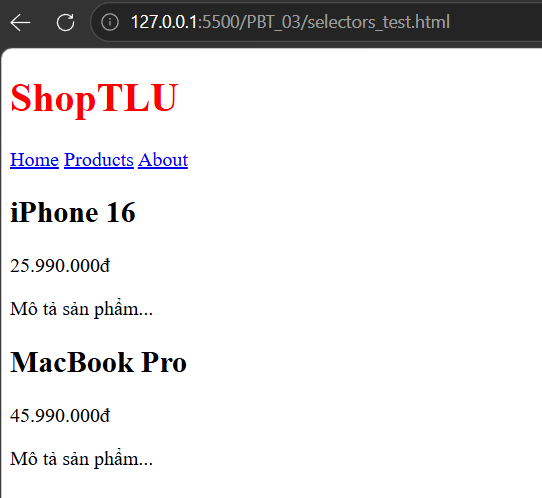

CÂU A1:
    + 3 cách nhúng CSS vào HTML:
        - Cách 1: Inline CSS: Thêm thuộc tính style vào thẻ muốn điều chỉnh
        VD: <h1 style="color: #2563eb; font-size: 32px;">Tiêu đề</h1>
        Ưu điểm: Nhanh, đơn giản, phù hợp để test nhanh giao diện
        Nhược điểm: Khó tái sử dung, khó bảo trì
        Khi nào nên dùng: Khi test thử giao diện, hoặc các phần tử không cần tái sử dụng
        - Cách 2: Internal CSS: Viết bên trong thẻ style trong file HTML (thường viết trong phần head)
        VD: <head>
                
            </head>
        Ưu điểm: Dễ quản lý, áp dụng được cho nhiều phần tử cùng lúc
        Nhược điểm: Làm cho file HTML dài hơn, khó tái sử dụng cho nhiều trang
        Khi nào nên dùng: Website chỉ có 1 trang, các demo
        - Cách 3: External CSS: Viết CSS trong 1 file riêng và liên kết với trang HTML qua thẻ link
        VD: *file style.css
            p {
                color: blue;
                font-size: 18px;
            }
            *file index.html
            <head>
                <link rel="stylesheet" href="style.css">
            </head>
        Ưu điểm: Chuyên nghiệp nhất, dễ bảo trì, tái sử dụng cho nhiều trang
        Nhược điểm: Nếu liên kết sai thì file sẽ không chạy CSS
        Khi nào nên dùng: Dự án thực tế, làm việc nhóm,Website lớn
        
        - Trả lời câu hỏi thêm: Nếu cả 3 cách CSS đồng thời áp dụng thì cái viết sau cùng sẽ thắng. Vì trình duyệt sẽ xét theo độ ưu tiên: Inline > Internal > External, nếu các khai báo cùng mức ưu tiên thì thuộc tính được viết sau cùng sẽ thắng.

CÂU A2:
    1. h1: Chọn thẻ h1
    
    
    
    2. .price: Chọn các class là price
    
    
    
    3. #app header: Chọn các header có trong phần tử có id là app
    
    
    
    4. nav a:first-child : Chọn phần tử con thẻ a đầu tiên trong thẻ nav
    
    
    
    5. .product.featured h2 : Chọn các thẻ h2 trong phần tử có class là product và featured
    
    
    
    6. article > p: chọn tất cả các thẻ p trong thẻ article
    
    
    
    7. a[href="/"] : chọn tất cả thẻ a có thuộc tính href="/"
    
    
    
    8..top-bar.dark h1: chọn thẻ h1 trong phần tử chứa class top-bar và dark
    
    
    

CÂU A3:
    Trường hợp 1:
        Chiều rộng hiển thị: 400 + 20 * 2 + 5 * 2= 450px
        Không giam chiếm trên trang: 450 + 10 *2 = 470px
    Trường hợp 2:
        Chiều rộng hiển thị : 400px
        Kích thước content thực tế: 400 - 20 * 2 - 5 * 2 = 350px
        Không gian chiếm trên trang 400 + 10 * 2 = 420px
    Trường hợp 3: 
        Khoảng cách giữa box-a và box-b: 40px
        Tại sao không phải 65px: Vì 2 block element nằm dọc thì margin dọc giữa 2 block element sẽ bị gộp lại và lấy giá trị lớn nhất.
    
    Trả lời câu hỏi nâng cao: 
        Khoảng cách giữa .box-a có margin-bottom: -10px và .box-b có margin-top: 40px là:
            40 + (-10) = 30px
CÂU A4:
1.
    Theo thứ tự ưu tiên: id->class->tag
    Rule A: 001 -> tổng = 1
    Rule B: 010 -> tổng = 10
    Rule C: 100 -> tổng = 100
    Rule D: 011 -> tổng = 11
2.
    Element sẽ có màu đỏ. Vì trình duyệt sẽ so sánh điểm thì sẽ thấy rule C có điểm cao nhất do đó nó thắng tuyệt đối mà không cần xét đến các cái còn lại
3. 
    Nếu thêm 
 thì element sẽ có màu cam 
4.
    Nếu Rule A thêm !important thì element sẽ có màu đen vì khi thêm !important thì trình duyệt sẽ cho ưu tiên tuyệt đối.

PHẦN B: THỰC HÀNH CODE
CÂU B2:
    Phần 1: 
        Hộp 1 (content-box): chiều rộng thực tế = 349.6 px 
        
        Hộp 2 (border-box): chiều rộng thực tế = 300 px 
        
        Giải thích sự khác biệt: 
        - Ở hộp 1 ta được chiều rộng thực tế là 349.6px trong khi chúng ta cho chiều rộng chỉ khoảng 300 đấy là vì với content-box mặc định thì chiều rộng chỉ áp dụng khu vực nội dung còn padding và border bị phình to ra nên t thấy được chiều rộng thực tế thay vì chỉ 300 thì nó cộng tiếp với padding và border.
        - Ở hộp 2 ta được chiều rộng thực tế là 300px vừa đúng với chiều rộng đã khai báo ban đầu đấy là vì với border-box thì padding và border sẽ co vào trong thay vì phình to ra
    Phần 2:
        Trường hợp 1: > 1000px
            vì không sử dụng border-box nên trình duyệt sẽ tính toán như sau:
            cột 1: 250 + 15*2 = 280px
            cột 2: 500 + 20*2 = 540px
            cột 3: 250 + 15*2 = 280px
            => 280 + 540 + 280 = 1100px
            .png)
            .png)
            .png)
            nhưng vì ở class container đã sử dụng display:flex thế nên trình duyệt sẽ ép các cột nhỏ lại để vừa 1000px
        Trường hợp 2: dùng border-box
             .png)
             cột 1 chiều rộng ta thấy vẫn bằng 250px
             .png)
             cột 2 chiều rộng ta thấy vẫn bằng 500px
             .png)
             cột 3 chiều rộng ta thấy vẫn bằng 250px
             => 250 + 500 + 250 = 1000px
 CÂU B3:
    

    

    

  
