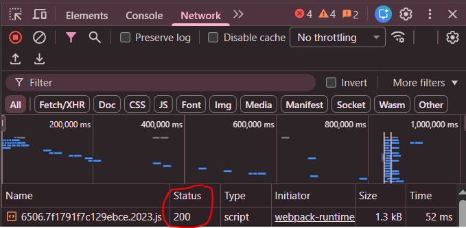
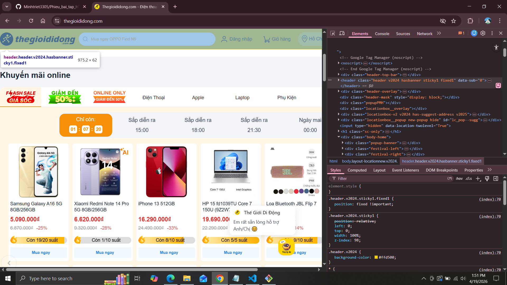
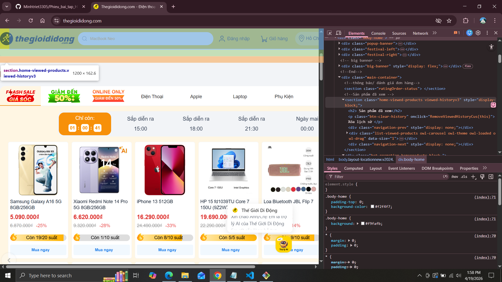
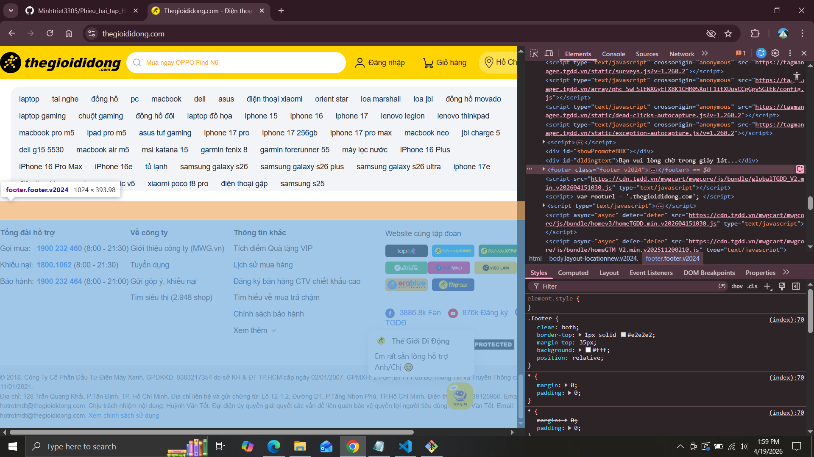
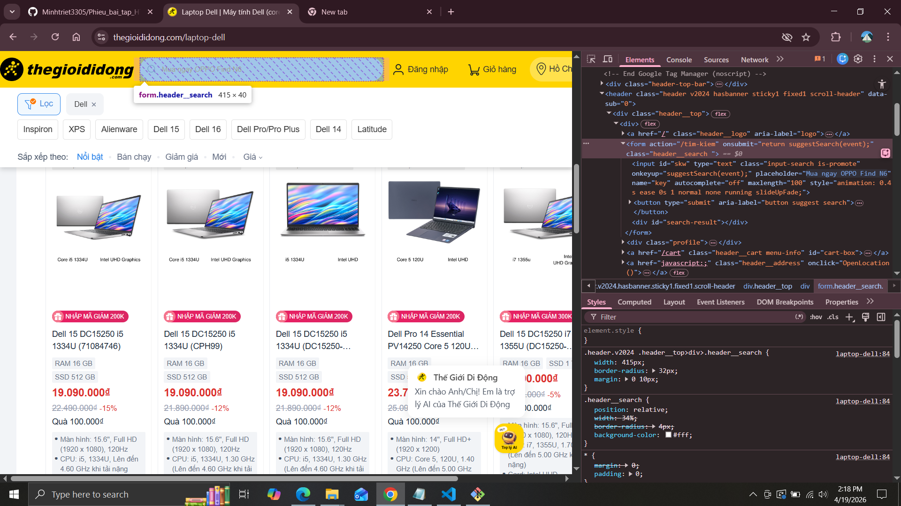
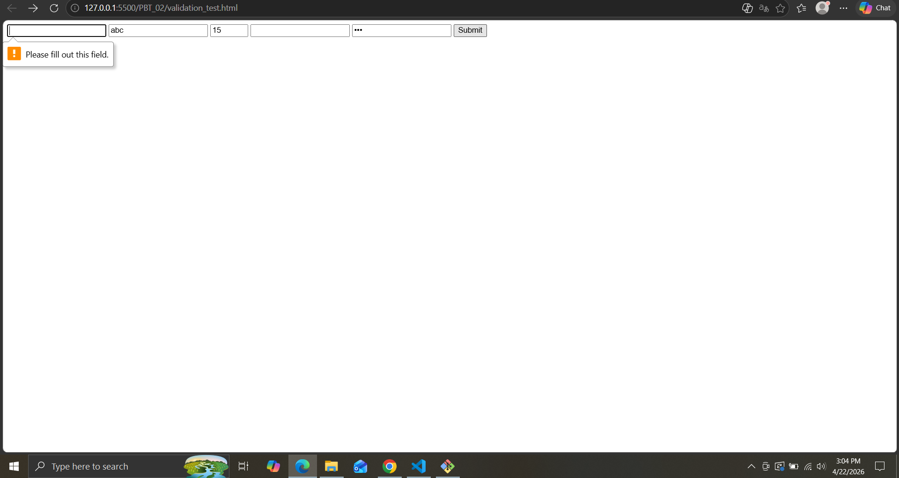
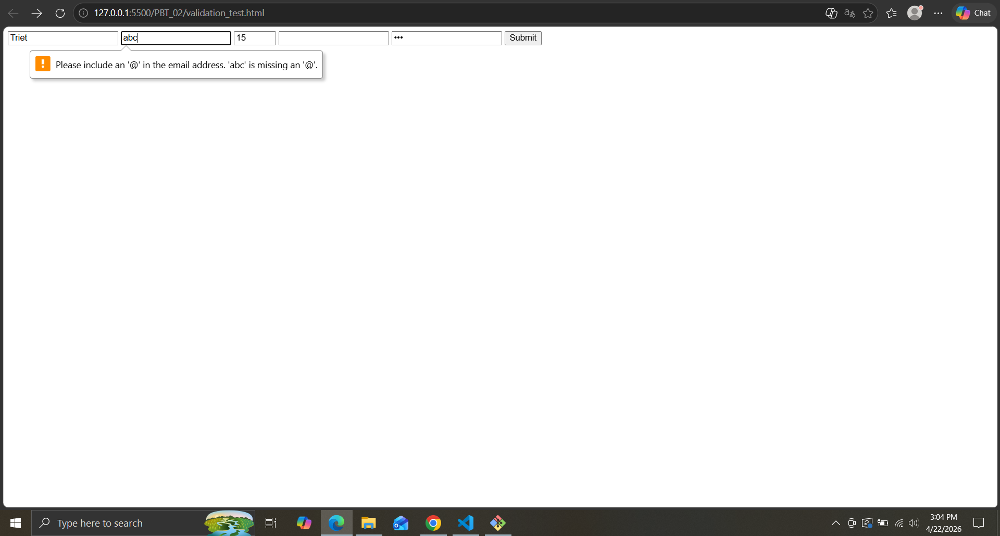
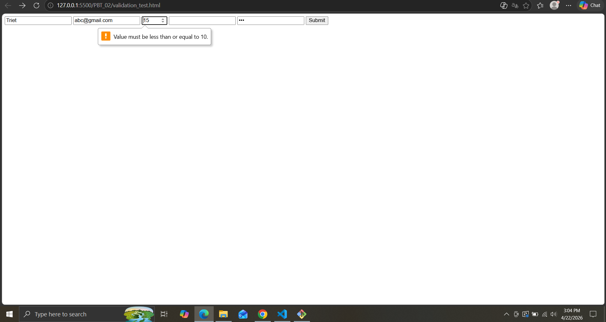
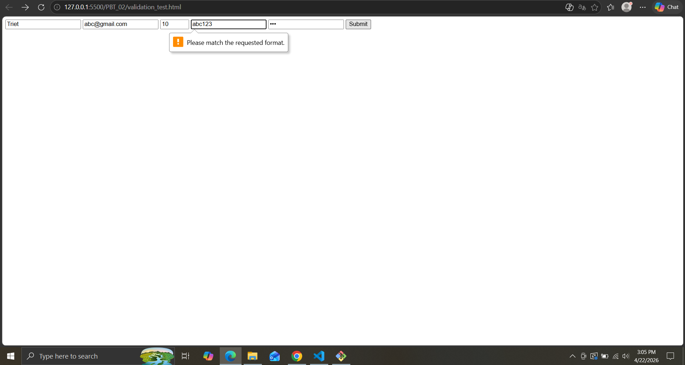

BÀI A1:
    1.
        Khi ta mở chrome và gõ https://shopee.vn sau đó nhấn phím enter.
            1.Request xuất phát từ máy tính cá nhân -> đi qua router wifi  
            -> Qua nhà mạng -> chạy qua cáp quang 
            2. -> Đến data center của Shopee ở Việt Nam
            3. -> Server xử lý: "Tôi muốn truy cập trang chủ Shopee"
            4. -> Response chạy ngược lại: cáp quang -> nhà mạng -> router -> máy tính cá nhân
            5. -> Chrome nhận file HTML,CSS,JS -> render ra giao diện -> thấy trang chủ của shopee
    2.
        
        Status code của request đầu tiên: 200 (Thành công và trả về kết quả)
        
        Tổng thời gian load trang: 1.46 giây
        
        Request trả về file CSS trong đó : status code: 200 (Thành công và trả về kết quả), thời gian thực hiện của request: 73ms
BÀI A2:
    +Tại sao trang web bị Google đánh giá SEO thấp?
        Vì đoạn code sử dụng thẻ 
 cho mọi thứ thay vì semantic tags.
        -> Google không thể hiểu cấu trúc trang -> xếp hạng thấp trong kết quả tìm kiếm
    + 4 lỗi semantic:
        -Lỗi 1: dòng 
 thay vì <header> khiến cho google không thể nhận diện phần header
        -Lỗi 2: dòng 
 và 
<a> thay vì <nav>
            + Vấn đề: Menu không được đánh dấu sementic 
            + Sửa: <nav><ul><li><a>...</a></li></ul></nav>
        -Lỗi 3: dòng 
 thay vì <main>
            + Vấn đề: Nội dung chính không được xác định
            + Sửa: <main>...</main>
        -Lỗi 4: 
 + 
 thay vì <article> + <h2>
            - Vấn đề: Sản phẩm không cấu trúc đúng, không hỗ trợ schema.org/Product 
    -Đoạn code sau khi đã sửa: 
        <header>
            
ShopTLU

            <nav>
            <ul>
                <li><a href="/">Trang chủ</a></li>
                <li><a href="/products">Sản phẩm</a></li>
            </ul>
            </nav>
        </header>   

        <main> 
            <article class="product">
                <h2>iPhone 16 Pro</h2>
                <figure></figure>
                
25.990.000đ

            </article>
        </main>

        <footer> 
             
&copy; 2026 ShopTLU

        </footer>

BÀI A3:
    

    Giải thich:
    - 
: Chiếm cả dòng có thể xuống dòng mới và điều chỉnh chiều rộng,dài
    - : Chỉ chiếm phần nội dung,nằm cùng dòng với nhau
    - <strong> : Chỉ chiếm phần nội dung,nằm cùng dòng với nhau,in đậm để nhấn mạnh nội dung

BÀI B3: PHẦN B-THỰC HÀNH CODE
    Lỗi 1: Dòng 136 — <!DOCTYPE> không đầy đủ
       Cách sửa: <!DOCTYPE html>

    Lỗi 2: Dòng 137 — <html> thiếu lang="vi"
        Cách sửa: <html lang="vi">

    Lỗi 3: Dòng 139 — <title> thiếu thẻ đóng
        Cách sửa: <title>Trang web</title>

    Lỗi 4: Dòng 140 — charset viết sai (utf8 -> UTF-8)
        Cách sửa: <meta charset="UTF-8">

    Lỗi 5: Dòng 143 — <h1> đóng tag sai 
        Cách sửa: <h1>Welcome to ShopTLU</h1>

    Lỗi 6: Dòng 147 — <a> thiếu thẻ đóng  
        Cách sửa: <a href="home">Trang chủ</a>

    Lỗi 7: Dòng 155 —  không có dấu ngoặc kép quanh src
        Cách sửa: 

    Lỗi 8: Dòng 157 — <b> và 
 bị nhầm vị trí 
        Cách sửa: 
Giá: <b>25.990.000đ</b>

    Lỗi 9: Dòng 162-171 — <table> thiếu <thead>, <tbody>
        Cách sửa:  <table>
                        <thead>
                            <tr>
                                <td>Tên</td>
                                <td>Giá</td>
                            </tr>
                        </thead>

                        <tbody>
                            <tr>
                                <td>iPhone</td>
                                <td>25tr</td>
                            </tr>
                        </tbody>
                    </table>

    Lỗi 10: Dòng 175 — Có 2 thẻ <main> 
            Cách sửa:   <aside>
                            
Sidebar content

                        </aside>

    Lỗi 11: Dòng 180 — 
 trong <footer> không đóng tag
            Cách sửa: 
Copyright 2026

BÀI B4: PHÂN TÍCH TRANG WEB THẬT - PHẦN B: THỰC HÀNH CODE
    1. 3 thẻ semantic HTML5 mà trang đã sử dụng:
        
        - thẻ <header>: vị trí thẻ: ở trên cùng của đoạn mã
        
        - thẻ <section>: vị trí thẻ: nằm bên trong thẻ 

        
        - thẻ <footer>: vị trí thẻ: nằm dưới cùng của đoạn mã
    3. thẻ <form> trên trang:
        
        bên trong form có:
            - action: action="/tim-kiem"
            - input: type="text"

BÀI C1: THIẾT KẾ KIẾN TRÚC - PHẦN C: SUY LUẬN
<!DOCTYPE html>
<html lang="vi">
<head>
    <meta charset="UTF-8">
    <meta name="viewport" content="width=device-width, initial-scale=1.0">
    <title>Chi tiết sản phẩm — iPhone 16 Pro Max</title>
</head>
<body>
    <!-- HEADER: Sử dụng <header> vì đây là phần đầu trang, chứa logo và navigation chính -->
    <header>
        <nav aria-label="main navigation">
            <!-- nav vì đây là điều hướng chính của trang -->
            <a href="/">Trang chủ</a>
            <a href="/products">Sản phẩm</a>
            <a href="/about">Về chúng tôi</a>
            <a href="/contact">Liên hệ</a>
        </nav>
    </header>

    <!-- main vì đây là nơi nội dung chính của trang -->
    <main>
        <nav aria-label="breadcrumb"> <!-- nav vì đây là điều hướng -->
            <ol> <!-- ol vì breadcrumb có thứ tự -->
                <li><a href="/">Trang chủ</a></li>
                <li><a href="/category/electronics">Điện tử</a></li>
                <li><a href="/category/smartphones">Điện thoại</a></li>
                <li aria-current="page">iPhone 16 Pro Max</li>
            </ol>
        </nav>

        <!-- <article> vì mỗi bình luận là nội dung độc lập -->
        <article>
            <!-- <section> để phân đoạn nội dung>
            <!-- <section>: Khu vực ảnh sản phẩm -->
            <section aria-labelledby="product-gallery-heading">
                <!-- section vì đây là một phần logic riêng của trang -->

                <h2>Hình ảnh sản phẩm</h2>
                
                <!-- <figure> vì ảnh sản phẩm là nội dung, kèm caption -->
                <figure>
                    
                </figure>

                <aside aria-label="product image thumbnails">
                    <!-- aside vì đây là nội dung bổ sung -->
                    
                    
                    
                    
                </aside>
            </section>

            <!-- SECTION: Thông tin sản phẩm cơ bản -->
            <section aria-labelledby="product-info-heading">
                <h2>Thông tin sản phẩm</h2>

                <!-- <header> cho section: chứa tiêu đề và đánh giá-->
                <header>
                    <h1>iPhone 16 Pro Max</h1>
                    <!-- h1 vì đây là tiêu đề chính của trang chi tiết sản phẩm -->
                    
                    <!-- Đánh giá sao -->
                    

                        ⭐⭐⭐⭐☆
                        (2,540 đánh giá)
                    

                </header>

                <!-- Mô tả ngắn -->
                
<strong>Mô tả:</strong> iPhone 16 Pro Max với chip A18 Pro, camera 48MP, màn hình 6.9 inch Super Retina XDR.

                <!-- Giá sản phẩm -->
                

                    <strong>25.990.000đ</strong>
                    <!-- <strong> để nhấn mạnh giá hiện tại -->
                

            </section>

            <!-- SECTION: Bảng thông số kỹ thuật -->
            <section aria-labelledby="specs-heading">

                <h2>Thông số kỹ thuật</h2>

                <!-- <table> vì đây là dữ liệu dạng bảng (hai cột: thông số + giá trị) -->
                <table>
                    <!-- <thead>: Phần header của bảng, định danh cột -->
                    <thead>
                        <tr>
                            <th colspan = "2">Thông số</th> <!-- thẻ <th> chứa heading của bảng>
                            <!-- colspan để merge 2 cột của bảng >
                        </tr>
                    </thead>

                    <!-- <tbody>: Phần nội dung chính của bảng -->
                    <tbody>
                        <tr>
                            <td>Màn hình</td> <!-- thẻ <td> chứa data bảng>
                            <td>6.9 inch Super Retina XDR</td>
                        </tr>
                        <tr>
                            <td>Chip</td>
                            <td>Apple A18 Pro</td>
                        </tr>
                        <tr>
                            <td>Camera chính</td>
                            <td>48MP f/1.78 Quad-pixel sensor</td>
                        </tr>
                        <tr>
                            <td>Pin</td>
                            <td>4,700 mAh (hoạt động 33 giờ)</td>
                        </tr>
                        <tr>
                            <td>Chống nước</td>
                            <td>IP69 (chống nước sâu 6m)</td>
                        </tr>
                    </tbody>

                    <!-- <tfoot>: Phần cuối bảng, thường chứa tóm tắt/tổng hợp -->
                    <tfoot>
                        <tr>
                            <td colspan="2">Xem thêm chi tiết trên Apple.com</td>
                        </tr>
                    </tfoot>
                </table>
            </section>

            <!-- SECTION: Khu vực đánh giá và bình luận -->
            <section aria-labelledby="reviews-heading">
                <h2>Đánh giá từ khách hàng</h2>

                <!-- <article> cho mỗi bình luận vì mỗi đánh giá là một nội dung độc lập -->
                <article>
                    <header>
                        <h3>Sản phẩm tuyệt vời!</h3>
                        
Bởi <strong>Nguyễn Văn A</strong>

                    </header>
                    
Màn hình sáng, camera chụp hình rất đẹp, pin kéo cả ngày.

                    
Đánh giá: ⭐⭐⭐⭐⭐

                </article>

                <article>
                    <header>
                        <h3>Giá hơi cao nhưng xứng đáng</h3>
                        
Bởi <strong>Trần Thị B</strong> 

                    </header>
                    
Sản phẩm chất lượng tốt, giao hàng nhanh. Sẽ mua lại.

                    
Đánh giá: ⭐⭐⭐⭐

                </article>
            </section>
        </article>

        <!-- <aside> vì đây là nội dung bổ sung, có thể loại bỏ mà vẫn không ảnh hưởng tới nội dung chính -->
        <aside aria-labelledby="related-products-heading">
            <h2>Sản phẩm tương tự</h2>

            <!-- Mỗi sản phẩm tương tự là một <article> -->
            <article>
                <figure>
                    
                    <figcaption>iPhone 16 Pro</figcaption>
                </figure>
                
<strong>22.990.000đ</strong>

                <a href="/product/iphone-16-pro">Xem chi tiết</a>
            </article>

            <article>
                <figure>
                    
                    <figcaption>iPhone 15 Pro Max</figcaption>
                </figure>
                
<strong>20.990.000đ</strong>

                <a href="/product/iphone-15-pro-max">Xem chi tiết</a>
            </article>

            <article>
                <figure>
                    
                    <figcaption>Samsung Galaxy S24 Ultra</figcaption>
                </figure>
                
<strong>24.990.000đ</strong>

                <a href="/product/samsung-s24-ultra">Xem chi tiết</a>
            </article>
        </aside>
    </main>

    <!-- <footer> vì đây là phần chân trang, chứa thông tin liên hệ + copyright -->
    <footer>
        <nav aria-label="footer links">
            <!-- nav cho các link chân trang -->
            <ul>
                <li><a href="/about">Về chúng tôi</a></li>
                <li><a href="/privacy">Chính sách bảo mật</a></li>
                <li><a href="/terms">Điều khoản dịch vụ</a></li>
                <li><a href="/contact">Liên hệ</a></li>
            </ul>
        </nav>
        
&copy; 2026 ShopTLU. All rights reserved.

    </footer>
</body>
</html>

CÂU C2 - SO SÁNH VÀ TRANH LUẬN - PHẦN C: PHẢN BIỆN
 Tôi không đồng ý với quan điểm trên.Mặc dù dùng thẻ 
 có thể sẽ nhanh hơn so với thẻ semantic.Nhưng xét về lợi ích thì 
 mang lại lợi ích kém hơn so với dùng thẻ semantic.

 1. Lý do kỹ thuật: SEO
    Google không chỉ đọc nội dung trong trang mà còn phân tích cấu trúc của trang web.Khi bạn dùng 
 cho header thì Google sẽ không biết đó là phần đầu trang.Nếu dùng thẻ semantic như: <header>, <nav>, <article>,... có thể giúp Google hiểu rõ hơn về cấu trúc trang cùng với đó trang sẽ được đẩy lên đầu.
    - Ví dụ: Khi ta dùng công cụ dev tool để so sánh giữa trang web sử dụng thẻ 
 và trang sử dụng các thẻ semantic sẽ thấy trang sử dụng các thẻ semantic sẽ được đẩy lên đầu trang.
2. Lý do kỹ thuật: Accessibility
    Người dùng khiếm thị dùng screen reader (công cụ đọc trang web) để duyệt internet. Khi gặp <nav>, screen reader sẽ thông báo "Điều hướng", giúp người dùng nhảy trực tiếp đến phần menu thay vì phải nghe toàn bộ trang. Nếu dùng 
, screen reader chỉ đọc là "div", người dùng sẽ lúng túng.

3. Trường hợp thực tế mà thẻ 
 vẫn phù hợp
    -Dùng gom nhóm để căn chỉnh CSS cho các bố cục trong trang web

=======================================================================================================
PHIẾU BÀI TẬP 2: HTML_Forms_Media

CÂU A1: Input Types
1. type="text" -> Ô nhập text, không có validation tự động -> dùng cho form nhập thông tin
2. type="email" -> Ô nhập text, có tự kiểm tra @ -> dùng cho form đăng nhập, đăng ký
3. type="password" -> Ô nhập text có ẩn ký tự, không có validation tự động -> dùng cho form đăng nhập, đăng ký
4. type="number" -> Ô nhập số có nút tăng giảm, có các validation: min,max,step -> dùng khi chọn số lượng sản phẩm
5. type="tel" -> Ô nhập số có bàn phím số trên điện thoại, có validation: pattern -> dùng cho form nhập thông tin liên hệ
6. type="date" -> Bộ chọn ngày tháng năm, có kiểm tra định dạng ngày,tháng,năm và min, max -> dùng cho form nhập thông tin cá nhân 
7. type="color" -> Bộ chọn màu sắc, không có validation tự động -> dùng khi chọn màu sản phẩm
8. type="range" -> Thanh kéo, kiểm tra min, max, step -> dùng chọn khoảng giá sản phẩm
9. type="file" -> Tải file lên, có giới hạn loại file (accept), chọn nhiều file (multiple) -> dùng khi tải ảnh sản phẩm lên phần đánh giá
10. type="search" -> Ô nhập tìm kiếm, không có validation tự động -> dùng khi tìm kiếm sản phẩm

CÂU A2: 
DỰ ĐOÁN:
    - Trường hợp 1: submit thất bại vì trong thẻ <input> dùng type="text" có require bắt buộc phải có giá trị nhưng giá trị lại để trống khi bấm submit sẽ hiện thông báo lỗi.
    
    - Trường hợp 2: submit thất bại vì type="email" nên sẽ có kiểm tra xem giá trị có "@" hay không nhưng giá trị trong thẻ lại là "abc" không có dấu @ nên khi bấm submit sẽ hiện thông báo lỗi.
    
    -Trường hợp 3: submit thất bại vì trong thẻ <input> dùng type="number" và 2 thuộc tính min="1" và max="10" nhưng giá trị lại là 15 vượt quá giới hạn nên khi submit sẽ hiện thông báo lỗi.
    
    -Trường hợp 4: submit thất bại vì trong thẻ <input> dùng type="text" và có pattern="[0,9]{10}" yêu cầu nhập 10 số với giá trị từ 0 đến 9 nhưng giá trị đầu vào lại có "abc" nên khi bấm submit sẽ hiện thông báo lỗi.
    
    -Trường hợp 5: submit thất bại vì trong thẻ <input> dùng type="password" và yêu cầu tối thiểu độ dài là từ 8 (minlength="8") nhưng giá trị độ dài chỉ có 3 nên khi submit sẽ hiện thông báo lỗi 
    

CÂU A3: 
    1. Screen reader là công cụ giúp người khiếm thị nghe được nội dung trang web.Khi người đọc lướt đến khu vực có thẻ <input> mà không có thẻ <label> chứa id định dạng của input thì screen reader sẽ không biết thẻ <input> dùng để nhập cái gì.Khi có thuộc tính id trong <input> và for trong <input> thì khi lướt đến công cụ screen reader sẽ đọc khi khu vực này nhập gì.
    2. Trong 1 form có nhiều thẻ <input> và nếu muốn tổ chức form rõ ràng cho người dùng.
    VD:
        <form>
            <fieldset>
                <legend>Thông tin cá nhân</legend>
                
                <label>Họ tên:</label>
                <input type="text">  
                
                <label>Email:</label>
                <input type="email">
            </fieldset>

            <fieldset>
                <legend>Sở thích</legend>
                
                <input type="checkbox"> Đọc sách 
                <input type="checkbox"> Chơi game 
                <input type="checkbox"> Code
            </fieldset>
        </form> 
    Ta thấy như ví dụ trên nếu sử dụng <field set> + <legend> ta sẽ dễ dàng nhân biết được các khung input khác nhau và mỗi khung có 1 tiêu đề rõ ràng.
    3. aria-label có thể được dùng nếu như ta không sử dụng thẻ <label> cho <input>.Nếu như ta đã có thẻ <label> mà dùng tiếp aria-label thì sẽ bị thừa.

CÂU A4:
    1. Thuộc tính loading="lazy" trong thẻ  giúp cho ảnh chỉ hiển thị khi lướt đến.Nó giúp cải thiện tốc độ load trang, nếu người dùng không lướt đến khu vực đấy thì trang sẽ không hiện ảnh giúp tiết kiệm data.
        - Khi nào không nên dùng:
            + Nếu người dùng muốn thấy ảnh ngay không phải lướt đến mới thấy.
            + Các logo,ảnh bìa đây là những ảnh cần hiển thị ngay
    2. Tại sao nên cấp nhiều <source> cho thẻ <video>.
        -Ở một số trình duyệt như Google,Firefox,... có thể hỗ trợ được nhiều loại video nhưng không phải trình duyệt nào cũng hỗ trợ hết 100% như Google có hỗ trợ MP4,WebM nhưng Firefox chỉ hỗ trợ WebM,Ogg chứ không hỗ trợ MP4 nếu như không có thẻ <source> để lựa chọn phương án thì sẽ không xem được video.
       Một số format phổ biến:
        + MP4: Phổ biến nhất, hỗ trợ tốt trên hầu hết trình duyệt và thiết bị.
        + WebM : Định dạng mã nguồn mở, tối ưu cho web.
        + Ogg: Định dạng mã nguồn mở, ít phổ biến nhưng vẫn được một số trình duyệt hỗ trợ.
    3.
        Thuộc tính alt dùng để thay thế ảnh không thể hiển thị bằng dòng text cho biết ảnh đấy là gì.
        - thuộc tính alt cho các trường hợp:
            + Iphone 16: alt="iPhone 16 Pro Max 256GB Titanium Gray"
            + Decorative: alt="" 
            + Biểu đồ doanh thu Q1/2026: alt="Q1 2026 Doanh thu: Tháng 1: 100 triệu, Tháng 2: 180 triệu, Tháng 3: 360 triệu"
 
CÂU A5:

